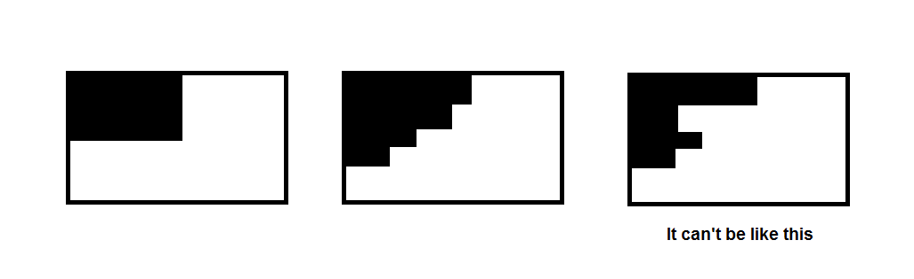
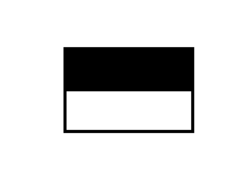
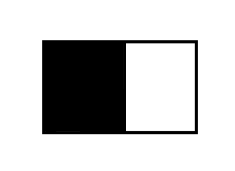

# TwoConvexShapes

作者：沈睿

关键词：容斥、计数、递推

## 题目简述

给你一个$$n*m$$的矩阵，矩阵中有些格子只能被染成黑色，有些格子只能被染成白色，而有些格子两种颜色均可被染上。但合法染色方案必须满足任意两个同颜色格子之间的格子也必须是该颜色。问合法染色方案数，对$$10^{9}+7$$取模。

数据范围：$$1\le n\le 50$$

## 题解

我们来观察一下最后的成图要满足怎样的条件才是合法的。



我们不难发现成图必须满足以下几个条件：

1、黑色和白色的格子各自形成了一个联通块。

2、对于每行黑块白块的**分界处**由上自下形成了一个**单调不降**或**单调不增**的序列。

于是我们可以根据这个**单调不降**或者**单调不增**的性质进行计数。

我们不妨先行统计，

$$1.$$**黑色**居于左侧，而且分界点单调**不降**的方案数，可以写出如下递推式：


$$
f_{i,j}=[can(i,j)]\sum_{k=1}^{k<=j} f_{i-1,k}
$$


其中$$can(i,j)$$是指第$$i$$行中，$$1$$位置到$$j$$的位置均满足染成黑色的条件，$$j+1$$位置到$$m$$位置均满足染成白色的条件。  
这个递推暴力是$$O(n^{3})$$的，但我们可以进行如下的前缀和优化做到$$O(n^{2})$$：


$$
sum_{i,j}=sum_{i,j-1}+[can(i,j)]sum_{i-1,j}
$$


同理，

$$2.$$**白色**居于左侧，分界点单调**不降**

$$3.$$**黑色**居于左侧，分界点单调**不增**

$$4.$$**白色**居于左侧，分界点单调**不增**

以上三种情况，都可以用如上讲述的方法进行统计。

但是不难发现，我们的统计当中有一些重复，不妨让我们一一列举一下：  


$$5.$$每**行**都是同种颜色，而且**黑色**居于上方的的方案，在$$2.3.$$情况下被重复计算过，固然减去。

同理，$$6.$$每**行**都是同种颜色，而且**白色**居于上方的的方案，在$$1.4.$$情况下被重复计算过，固然减去。  


$$7.$$每**列**都是同种颜色，而且**黑色**居于左侧的的方案，在$$1.3.$$情况下被重复计算过，固然减去。

同理，$$8.$$每**列**都是同种颜色，而且**白色**居于左侧的的方案，在$$2.4.$$情况下被重复计算过，固然减去。  


$$9.$$全黑的方案数，在$$1.2.3.4.$$被计入过，在$$5.6.7.8.$$中被减去过，固然计入。

同理，$$10.$$全白的方案数，在$$1.2.3.4.$$被计入过，在$$5.6.7.8.$$中被减去过。固然计入。

总的来说，这是一道很好（~~丧心病狂~~）的计数题，充分锻炼了选手的观察（~~乱搞~~）能力和代码（~~口胡~~）能力。

我写的代码时间复杂度为$$O(n^{3})$$，但对于程序的细节进行更好的把握，可以优化到$$O(n^{2})$$，在此不多赘述。

## 代码

```C++
#include<bits/stdc++.h>
#define FT first
#define SC second
#define PB push_back
#define MP make_pair
#define REP(i, l, r) for(int i = (l); i <= (r); i++)
#define PER(i, r, l) for(int i = (r); i >= (l); i--)
#define FOR(i, n) for(int i = 0; i < (n); i++)
#define ROF(i, n) for(int i = (n) - 1; i >= 0; i--)
#define VEP(i, x) for(int i = 0; i < x.size(); i++)
#define DFOR(i, x, y) for(int i = hd[x], y = e[i].to; i; i = e[i].nxt, y = e[i].to)
#define MEM(a, b) memset(a, b, sizeof(a))
#define rint read<int>()
#define rll read<LL>()

using namespace std;
typedef long long LL;
typedef long double LD;
typedef pair<int, int> PI;
const int inf = 0x7fffffff;
const int MOD = 1000000007;
template <typename tn> inline void cmax(tn &a, tn b){ if (a < b) a = b; }
template <typename tn> inline void cmin(tn &a, tn b){ if (a > b) a = b; }

const int N = 50 + 5;

class TwoConvexShapes  
{  
        public:  
        int f[N][N], can[N][N], ans, n, m;
        char a[N][N];

        void Non_decreasing(){//由上至下单调不降的情况 
            REP(i, 0, m) f[0][i] = 1;
            REP(i, 1, n) REP(j, 0, m){
                f[i][j] = j ? f[i][j - 1] : 0;
                if (can[i][j]) f[i][j] = (f[i][j] + f[i - 1][j]) % MOD;
            }
            ans = (ans + f[n][m]) % MOD;
        }

        void Non_increasing(){//有上至下单调不增的情况
            REP(i, 1, n / 2) REP(j, 0, m) swap(can[i][j], can[n - i + 1][j]);
            Non_decreasing();
            REP(i, 1, n / 2) REP(j, 0, m) swap(can[i][j], can[n - i + 1][j]);
        }

        void Exclusion_row(){//考虑每列的数都一样的情况。 
            REP(j, 0, n){
                int flag = 1;
                REP(i, 1, j) if (!can[i][m]) { flag = 0; break; }
                REP(i, j + 1, n) if (!can[i][0]) { flag = 0; break; }
                ans -= flag;
            }
        }

        void Exclusion_column(){//考虑每行的数都一样的情况 
            REP(j, 0, m){
                int flag = 1;
                REP(i, 1, n) flag &= can[i][j];
                ans -= flag;
            }
        }

        void Exclusion_all(){//所有格子颜色都相同的情况 
            REP(i, 1, n) REP(j, 1, m) if (a[i][j] == 'W') return;
            ++ans;
        }

        void UpdateAns(){
            REP(i, 1, n) REP(j, 0, m){
                can[i][j] = 1;
                REP(k, 1, j) if (a[i][k] == 'W') {can[i][j] = 0; break;}
                REP(k, j + 1, m) if (a[i][k] == 'B') {can[i][j] = 0; break;}
            }    
            Non_decreasing();
            Non_increasing();
            Exclusion_row();
            Exclusion_column();
            Exclusion_all();
        }

        int countWays(vector <string> grid)  
        {  
            n = grid.size(), m = grid[0].size(), ans = 0;

            REP(i, 1, n) REP(j, 1, m) a[i][j] = grid[i - 1][j - 1];
            UpdateAns();

            //由于颜色是相对的，在10种情况中黑白各占一半，将黑色和白色交换再做一次统计可以省略很多代码
            REP(i, 1, n) REP(j, 1, m)
                if (a[i][j] == 'B') a[i][j] = 'W'; else
                if (a[i][j] == 'W') a[i][j] = 'B';
            UpdateAns();

            return (ans + MOD) % MOD;
        }  
};
```


