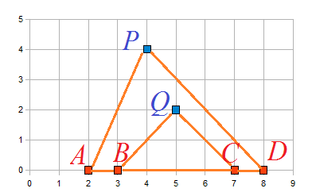

# Ear

作者 : 周子鑫 徐明宽

关键词 : 几何、数学

## 题目简述

在坐标系上有一些红点和一些蓝点，其中红点都在$$X$$轴上，蓝点都在$$X$$轴上方。对于一个由$$4$$个红点$$(A, B, C, D)$$和两个蓝点$$(P, Q)$$组成的集合，我们定义它为"Ear"当且仅当它们满足下面的条件：

* $$B, C$$严格在线段$$AD$$内。
* $$P$$点在$$X$$轴上的投影严格在$$AD$$ 内，$$Q$$点在$$X$$轴上的投影严格在$$BC$$内。
* $$Q$$点严格在三角形$$PAD$$内。

（脑补一下这个就是个耳朵，例如下图：

 

现在给你$$n$$红点和$$m$$个蓝点，求总共有多少只"Ear"。

$$n, m \le 300$$

## 分析

这种类型的题目，首先是要确定固定哪些点。

相对来说$$P$$和$$Q$$这两个点的限制比较复杂（要求$$Q$$在三角形内），那么就先把$$P、Q$$两个点先枚举一下。

再枚举一个红点$$D$$就行了。

那么如何将$$Q$$在三角形$$APD$$这个限制转化为容易计算的限制呢？ 只要向量$$AQ$$在向量$$AP$$右侧就行了。

## 算法一

枚举完$$P, Q, D$$三个点之后：

* $$C$$点的位置就已经确定下来了，$$C$$只有可能在$$Q$$投影和$$D$$之间，而且$$C$$点的位置不受$$A$$ $$B$$影响（因为$$A$$　$$B$$两个点都在$$Q$$的投影左侧）
* 接下来考虑$$A$$点的位置，因为有个限制是$$Q$$在三角形$$PAD$$之内，所以$$A$$点一定在直线$$PQ$$与$$X$$轴交点的左侧。需要注意的是，$$A$$点还有一个限制就是$$A$$要在$$P$$点投影的左侧。
* 接下来$$B$$的位置就简单了，$$B$$一定在$$A$$点和$$Q$$点投影之间。

考虑如何计算答案：

* $$C$$点的数目是确定的，可以直接根据$$D$$和$$Q$$的位置计算出来。时间复杂度$$O(1)$$
* 随着$$A$$点的移动，$$B$$点的可行区间也随之发生变化，$$B$$的可行区间右端点是已经确定的，而左端点就是$$A$$的位置。这样就发现，对于不同的$$A$$, 可行的$$B$$数量实际上是一个等差数列。时间复杂度$$O(1)$$

因此总的时间复杂度就是$$O(n \cdot m ^ 2)$$，空间复杂度$$O(n + m)$$

## 算法二

其实这道题中$$A$$点和$$D$$点的地位是等价的，那么既然不需要枚举$$A$$点的位置，不妨也不枚举$$D$$点的位置试试。即，只枚举$$P, Q$$两个点，现在我们再来看看都有哪些限制条件。

* 同样地，$$A$$点在直线$$PQ$$与$$X$$轴交点的左侧，也在$$P$$点投影的左侧。
* 对称地，$$D$$点在直线$$PQ$$与$$X$$轴交点的右侧，也在$$P$$点投影的右侧。
* $$B$$点在$$A$$点和$$Q$$点投影之间。
* $$C$$点在$$Q$$点投影和$$D$$点之间。

同样地，对于不同的$$A$$，可行的$$B$$数量仍然是一个等差数列。注意到$$D, C$$点的位置和$$A, B$$点的位置无关，而且$$D, C$$点与$$A, B$$点左右对称，所以对于不同的$$D$$，可行的$$C$$数量也是一个等差数列。把两个等差数列的和乘起来就得到了答案。

这样总时间复杂度就降低到了$$O(m ^ 2)$$。