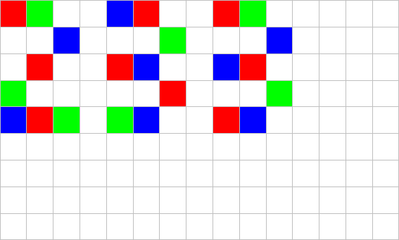
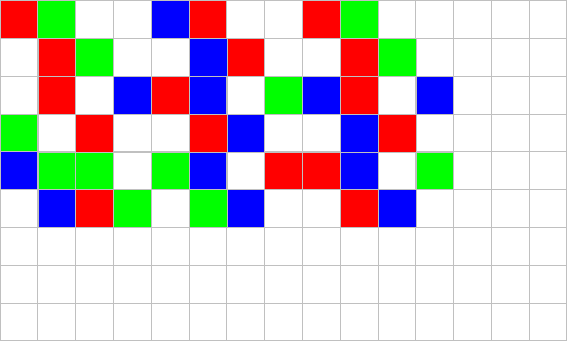
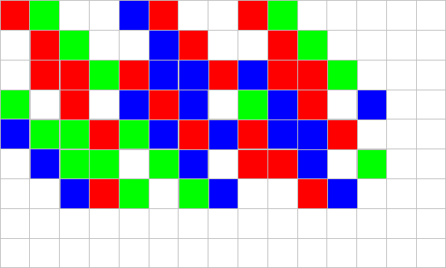
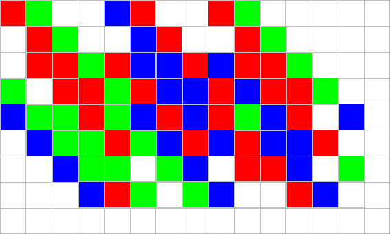
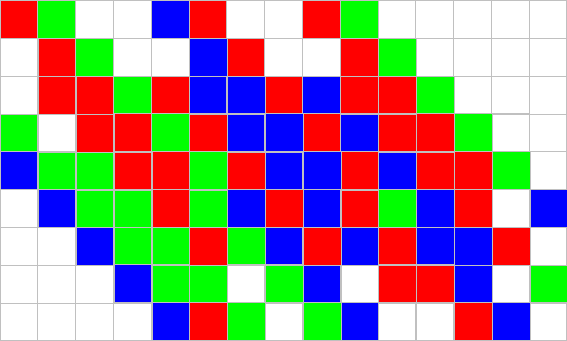
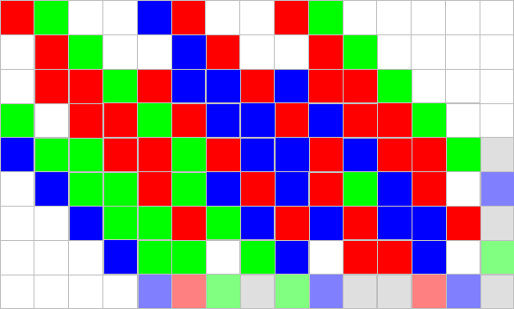
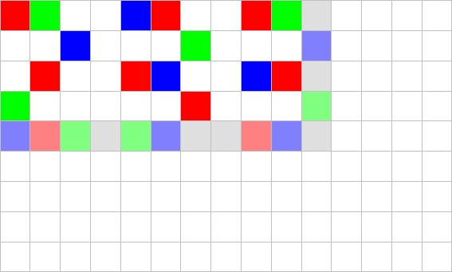
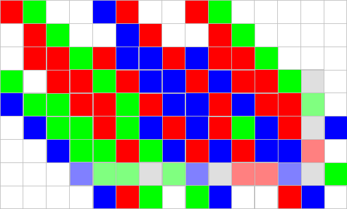
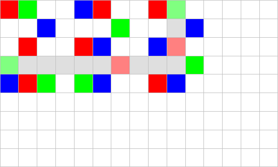

# PastingPaintingDivOne
作者：汪乐平 徐明宽

关键词：模拟 找规律 动态规划

## 题目简述

给一块$$w$$行$$h$$列的板，一些格子有颜色，有红、绿、蓝三种颜色。有一块无限大的纸，开始时所有格子都是白色的，板的左上角在$$(0,0)$$的位置上。每次操作将板按下一次，然后将板向右平移一格，再向下平移一格。将板按下时，对于板上的每一个格子，如果这个格子有颜色，则将这个格子覆盖的这一块纸染成这种颜色，否则没有影响。一共进行了$$T$$次操作，求纸上红、绿、蓝三种颜色占的面积各是多少。$$1\leq w,h\leq 50,1\leq T\leq 1000000000$$。

## 算法一

直接模拟每一次操作，时间复杂度$$O(Twh)$$。

## 算法二

定义某一次操作后的状态表示这次操作之后这块板盖住的这部分纸的染色情况。显然第$$i$$次操作后的状态是由第$$i$$次、第$$i-1$$次、……第$$max(0,i-min(w,h))+1$$次操作决定的。当操作了$$min(w,h)$$次之后，每次的状态都是由之前的$$min(w,h)$$次操作决定的，每次操作是一样的，所以状态就不会再改变了。如果状态不变，那么每次操作增加或减少的三种颜色的面积也是不变的。所以直接模拟每一次操作，如果发现状态不再改变了就直接计算剩下的每次操作对三种颜色面积的影响即可，时间复杂度$$O(min(w,h)wh)$$。

## 算法三

虽然算法二的时间复杂度足以通过本题，但是有时间复杂度$$O(wh)$$的算法吗？答案是肯定的。我们先来看一个样例：

 

  

 

 

 

可以看出每按下一次板，**有可能**有颜色的位置就增加了最下面一行和最右面一列的$$w+h-1$$格。而且第$$T$$次操作增加的最下面一行和最右面一列和初始给的那块板的最下面一行和最右面一列相同，像这样：

 

 

再看第$$T-1$$次操作增加的这$$w+h-1$$格，可以发现它是初始给的那块板的倒数第一行和倒数第一列这$$w+h-1$$格叠加上倒数第二行和倒数第二列这$$w+h-3$$格，像这样：

 

 

类似地，对于任意$$1 \leq i < \min(T, w, h)$$，第$$T-i$$次操作增加的$$w+h-1$$格可以看做第$$T-i+1$$次操作增加的$$w+h-1$$格叠加上初始板子的倒数第$$i+1$$行和倒数第$$i+1$$列这$$w+h-1-2i$$格。而如果$$T > \min(w,h)$$，第一到第$$T-\min(w,h)$$次操作中每次操作增加的$$w+h-1$$格都与第$$T-\min(w,h)+1$$次操作增加的$$w+h-1$$格相同。所以，我们可以在$$O(\min(w,h) \cdot (w+h)) = O(wh)$$的时间复杂度内计算出所有$$T$$次操作**增加**的$$T \cdot (w+h-1)$$格对答案的影响。

现在这道题还没有做完——还剩第一次按下板时盖住的那部分纸的除了最下面一行和最右面一列以外的$$(w-1)\cdot(h-1)$$格。如果这部分暴力计算，时间复杂度是$$O(min(w,h)wh)$$的，这样就前功尽弃了。

可以考虑动态规划：$$f[i][j]$$表示第$$i$$行第$$j$$列的格子到右下方第一个不透明的格子的距离（如果第$$i$$行第$$j$$列的格子本身就是不透明的则为$$0$$）。它的转移很简单：$$f[i][j]=$$如果第$$i$$行第$$j$$列的格子不透明则为$$0$$，否则为$$f[i+1][j+1]+1$$。这样，第$$i$$行第$$j$$列的格子的最终颜色就可以从$$f[i - \min(i, j, T - 1)][j - \min(i, j, T - 1)]$$很简单地得到。

于是我们就得到了这样一个总时间复杂度仅为$$O(wh)$$的算法。具体实现细节可以参考[代码](xumingkuan.cpp)。