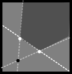

# CheckerFreeness
作者：汪乐平 钟知闲

关键词：凸四边形判定 压位

## 题目简述

给出$$W$$个白点和$$B$$个黑点，保证没有重点，且任意三点不共线。问是否存在一个凸四边形，满足一对相对的顶点均为白点，另一对相对的顶点均为黑点。$$1\leq W,B\leq 222,1\leq x,y\leq 10000000$$。

## 算法一

枚举每一对白点和黑点，显然四边形是凸的当且仅当对角线是相交的，所以用叉积判断两个白点连成的线段和两个黑点连成的线段是否相交即可，时间复杂度$$O(W^2B^2)$$。

## 算法二

换一种方法判断是否是凸四边形。假设已知一个黑点和两个白点，显然另一个黑点在下图所示的深色区域时这个四边形才是凸的。

考虑这个深色区域中的点有什么性质。设数组$$b[i][j][k]$$表示$$\angle ikj$$是否小于$$\pi $$（这里认为$$\angle ikj+\angle jki=2\pi $$）。假设已知的两个白点是$$w1$$和$$w2$$，黑点是$$b1$$，那么深色区域中的点$$x$$就满足$$b[w1][b1][x]\oplus b[w2][b1][x]=1$$且$$b[w1][w2][x]\oplus b[w1][w2][b1]=1$$。所以预处理出$$b$$，枚举$$w1,w2,b1,x$$就可以判断有没有符合条件的凸四边形了。

如果暴力枚举时间复杂度仍然是$$O(W^2B^2)$$的，但这种判断方法可以用$$bitset$$压位加速，所以判断的时间可以降为$$O(W^2B^2/w)$$，其中$$w$$表示字长。数组$$b$$三维的大小分别为$$W$$、$$W+B$$、$$B$$，求$$b[i][j][k]$$的值可以用叉积$$O(1)$$计算，所以预处理$$b$$的时间复杂度为$$O((W+B)WB)$$。所以总的时间复杂度为$$O((W+B+WB/w)WB)$$。

## 算法三

在上述算法基础上加一些小优化。考虑先枚举一个白点 $$A$$，然后将剩下的点以 $$A$$ 为中心极角排序，再枚举第二个白点 $$B$$。因为 $$A,B$$ 与另外两个黑点 $$C,D$$ 构成凸四边形 $$ACBD$$ 的条件是 $$C,D$$ 在直线 $$AB$$ 两侧，且 $$\angle CAB+\angle DAB<\pi$$，$$\angle CBA+\angle DBA<\pi$$，所以将黑点按照在直线 $$AB$$ 的哪一侧分成两组，按 $$\angle CAB$$ 从大到小的顺序枚举一侧的黑点 $$C$$，维护另一侧满足 $$\angle CAB+\angle DAB<\pi$$ 的黑点 $$D$$ 中 $$\angle DBA$$ 的最小值 $$\angle DBA_\min$$，如果 $$\angle CBA+\angle DBA_\min<\pi$$，那么就说明找到了这样的凸四边形，返回 `NO`，如果始终没找到，返回 `YES`。由于已按极角排序，满足 $$\angle CAB+\angle DAB<\pi$$ 的黑点 $$D$$ 在序列中是连续区间（环状的，可能是一段后缀加一段前缀），每枚举一个 $$C$$ 就扩展一下这个区间，即可对于每对 $$A,B$$ 做到 $$O(n)$$ 的复杂度，总复杂度为 $$O(n^3)$$（$$n$$ 为点数）。
