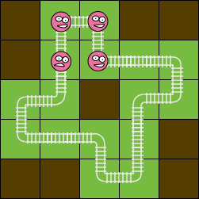
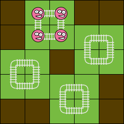

##CurvyonRails  

作者：吕欣  

关键词：图论建模，二分图，费用流  

###题意简述  

给定一个 $$n\times m$$ 的棋盘，标记棋盘上的一些格为城镇，再标记城镇中的一些为关键格。你需要铺设轨道，有以下要求：  

1. 非城镇上不允许铺设轨道。
2. 每个城镇铺一段轨道，连接它的四个边界中的两个。  
3. 每段轨道需要连接另外两段轨道。  

注意：所有城镇不必互相连通。不难想象，棋盘上的城镇被连接成了若干个互不相交的环。  

你需要尽可能地在关键格上铺设弯轨道。因此，对于一种合法的方案，定义它的费用为“铺设了直轨道的关键格的个数”。   

判断解的存在性，在此基础上，最小化铺设轨道的费用。  

约定：$$n,m\leq 25$$

下图展示了同一个棋盘上的两种不同的方案，费用分别为 $$1$$ 和 $$0$$。

    

###初步建模  

这道题需要稍稍脑洞大开的建图。  

首先，不考虑费用的问题，如何判断解的存在性？  

由于棋盘天然是二分图，对棋盘进行黑白染色之后，我们铺设的轨道总是连接着一个黑点和一个白点，由于不考虑城镇的连通性，这实际上是一个匹配问题，考虑建图：  

1. 对于每个城镇，$$S$$ 向黑格连流量为 $$2$$ 的边，白格向 $$T$$ 连流量为 $$2$$ 的边，代表每个城镇需要和相邻的两个城镇匹配；  
2. 对于相邻的两个城镇 $$i$$, $$j$$，不妨设 $$i$$ 为黑格，$$i$$ 向 $$j$$ 连接流量为 $$1$$ 的边，代表它们可以匹配。  

对这张图求 $$S$$ 到 $$T$$ 的最大流，检查 $$S$$ 连出的边和连入 $$T$$ 的边是否满流，即可判断解的存在性。  

另外，注意到黑白点数不一致时，一定无解，而黑点数=白点数时，$$S$$、$$T$$的连出、连入的边全部满流等价于 $$流量=黑点数*2$$，由此可以简化代码实现。

###最小化费用  

如何最小化费用呢？  

考虑如何区分弯轨道和直轨道，不难发现，弯轨道总是匹配了一个同行的点，和一个同列的点。与此相反，直轨道总是匹配了两个同行/同列的点，我们考虑如下的费用流建图。  

1. 首先 $$S$$ 向黑格连边、白格向 $$T$$ 连边与上述方法类似。  
2. 考虑拆点，对每个城镇 $$i$$，拆出两点 $$i_r$$，$$i_c$$，代表行上的匹配和列上的匹配，不妨设 $$i$$ 为黑格，白格的情况把边反向即可。    
	* 对关键格，$$i$$ 向 $$i_r$$、$$i_c$$ 分别连两条边，两条边的$$(流量, 费用)$$ 分别为 $$(1,0)$$ 和 $$(1, 1)$$，代表如果 $$i$$ 匹配了两个同行/同列的点，则需要支付一点费用。  
	* 对非关键格，$$i$$ 向 $$i_r$$, $$i_c$$ 分别连一条流量$$2$$，费用$$0$$的边，代表 $$i$$ 可以自由匹配两个点。  

3. 对同一行上相邻的点 $$i_r$$ 和 $$j_r$$，不妨设 $$i_r$$ 为黑格，$$i_r$$ 向 $$j_r$$ 连一条流量$$1$$，费用$$0$$的边，列上类似。  

对这个图求最小费用最大流，检查流量的大小，即可判断解的存在性。在此基础上，求得的费用值就是最小费用。  

上述方法中的一些点和边不是必要的，但这样的建图实现方便、容易理解，且足以胜任题目的数据规模。  

效率：  

算法的复杂度瓶颈在于费用流的计算。  
图的点数是 $$O(nm)$$ 级别的，边数和点数同级，因此：  

时间复杂度 $$O(\mathbf{costflow}(nm, nm))$$  
空间复杂度 $$O(nm)$$  