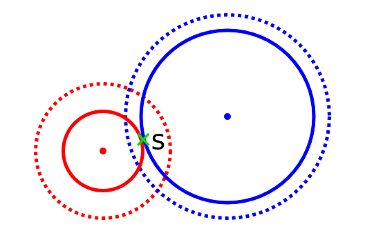
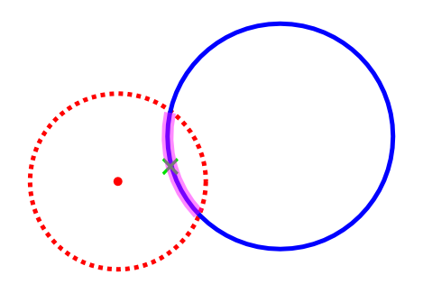
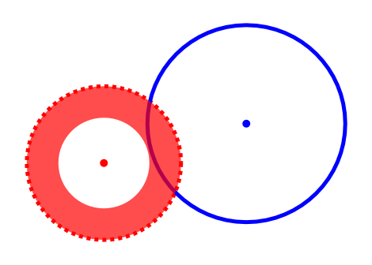
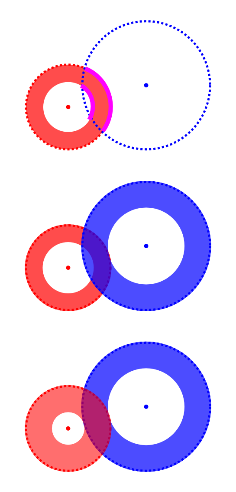

#CandyOnDisk
> 来源：TC SRM 571 Div1 1000
> 
> 作者：孙耀峰
> 
> 修改：
> 
> 关键词：计算几何，最短路

##题目简介
在二维平面上有$$N$$个圆，圆心为$$(x_i,y_i)$$，半径为$$r_i$$。给出起点$$(sx,sy)$$和终点$$(tx,ty)$$，求在有限次行动内是否可以从起点走到终点。

每次行动，可以选择一个圆，要求当前点被这个圆包含。然后将这个圆旋转任意角度，而这个点会随着这个圆同步旋转。

范围：$$N \le 50$$，$$-10^9 \le x_i,y_i,r_i,sx,sy,tx,ty \le 10^9$$。
##解题思路
###模型建立
我们先简化每次行动的意义。因为题目只需要我们回答是否可行，所以我们可以认为，如果当前点到第$$i$$个圆距离为$$dis(dis \le r_i)$$，则第$$i$$个圆上，所以距离圆心$$dis$$的点都是可达的。可以形容的视为一个圆弧。

这道题很显然是一个最短路的模型，最朴素的想法，是用二元组$$(i,dis)$$表示一个状态，表示到第$$i$$个圆距离为$$dis$$的点，我们需要对所有状态计算是否可达。然而这样做状态数爆炸，我们需要考虑减少状态数。
###状态数优化
通过观察会发现，某一个圆可以到达的点，肯定是一段连续的圆环，不可能多段。即不会有这种情况出现：

当然这也必须得有这个性质，要不然得怎么做呢。于是我们就可以对于每一个圆$$i$$，计算出$$low[i],high[i]$$，表示到第$$i$$个圆距离为$$[low[i],high[i]]$$之间的点都是可达的。
###如何计算low[i],high[i]?
现在考虑如何计算$$low[i],high[i]$$。一个朴素的想法，就是用暴力迭代求解。即直接枚举每一对圆，如果$$i$$圆可以更新$$j$$圆，则更新。可以用下面的图片方便理解：

乍一看觉得这个做法非常稳啊，但事实上这样暴力更新的效率是指数级的，因为两个有交的圆之间，在得到真实的$$low[i],high[i]$$过程中，他们之间需要进行若干次互相更新，如果更新顺序的不一样，或者多个圆有交的时候，这样的互相更新就会高达指数次。
###优化更新复杂度
现在我们考虑如何优化这个更新的过程。我们发现如果两个有交的圆$$i,j$$，令它们之间的距离为$$Dis$$，并考虑现在用$$i$$圆去更新$$j$$圆。如果$$[low[i],high[i]]$$和$$[Dis-r[j],Dis+r[j]]$$这两段区间没有交的话，则$$i$$不可能更新到$$j$$。否则，我们发现$$j$$圆会和$$[Dis-r[i],Dis+r[i]]$$取并，而$$i$$圆会和$$[Dis-r[j],Dis+r[j]]$$取并。

容易发现，这次更新和具体$$low,high$$的值没有关系，只和$$dis,r[i],r[j]$$有关，这就意味着，如果$$i,j$$之间的直接更新做过以后，$$i,j$$之后就不会再进行直接更新了，因为不会影响答案。所以不同的更新只会有$$N^2$$种。
###总结
接下来我们就可以用类似$$Bellman Ford$$，$$SPFA$$等算法的暴力迭代来更新出$$low[i],high[i]$$，效率上限为$$O(N^4)$$。

具体细节实现可以参见我的代码，似乎还会有被卡精度的情况出现？