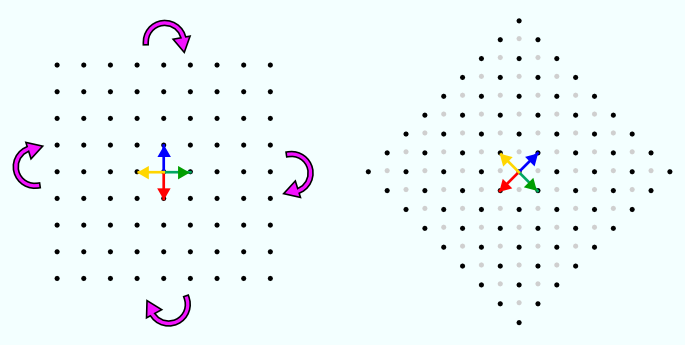

#WolfPack

###题目简述：
有n (n <= 50) 个点，每个点每秒钟可以向上下左右移动一单位，要求m(m <= 100000) 秒后所有点到同一点。求所有行动方案。

###思路：

我们旋转坐标45度，这样每一次移动可以转化为一次x轴的移动和一次y轴的移动，这样我们就可以将x、y分开讨论。

###算法
我们更改点坐标(x, y)为(x+y, x-y)。每一次移动可以沿x轴移动一步，y轴移动一步。最后所有点的x轴与y轴需要相同。我们将x,y分开讨论，我们枚举所有可能的x轴坐标，计算所有点到达此处的x的可能方案的乘积作为此时的总方案，再将所有x的方案相加。同理我们计算所有y的方案，再与x的方案相乘即可。

###评论
这个题的关键是每时每刻x,y都要移动，这样才能把x,y分开讨论。有人可能会说，如果不动也可以用组合数算，但可能出现x、y都没动的情形。