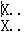
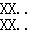

# Tunnels

作者：欧阳思琦

关键词：括号序列 dp 分类讨论

## 题目简述

有一种神奇的地道，将它看成二维平面后，如下图：

所有的房屋都在一条地平线上，每条地道都是从房屋底部向下伸出的，整个地下可以被分割成若干$$1\times 1$$的小方格，每条地道需要满足一些条件：

1. 每一对连续的方格共有一条边（连续的意思是向下延伸出来的顺序上是连续的）；
2. 不连续的任意一对方格都不共边；
3. 地道的第一个方格必须刚好在地平线下方；
4. 地道可以往下，往左，往右，不能往上走，不能走重复方格。

同时，任意一对地道都不相交（也就是说没有一个方格同时属于两条地道），而且不存在两条地道相邻（也就是说没有相邻的一对方格属于不同的地道）。

整个地图可以看成一个无限网格，现在给你截出中间的一个矩形部分，问你整个地图中最少的地道条数。

矩形的长宽$$\leq 50$$，给定的图案一定是合法的。

## 算法

这道题看上去的第一感觉就是：啊♂，好大。不过仔细想了想，感觉似乎还是可以做的，只是“稍微”麻烦一点。

首先我们先把给出来的图案中的连通块一个个找出来，然后一个连通块如果只和上边界相连，那么这个连通块显然我们管不到它；如果和左边界相邻，有可能和另一个连通块连起来减少地道的个数；右边界同理；只和下边界相邻。。。题目保证有解，不会有这种情况-。-

然后问题看上去就明了了很多是吧，答案就是总的连通快个数 - 最多的匹配的连通块对数，匹配的连通块个数看上去还是比较容易做的是吧，括号序列dp就好了，但是作为一道$$1050$$分的题，不会就这么简单的= =，出题人套路深。

首先我们来看看连通块可以怎样匹配，换句话说，连通块怎么样转换成左右括号。

考虑连通块在边界上的情况，根据地道不会向上跑，很显然只有连通块在边界上的最上和最下的方格才需要考虑。如果一个方格**必须**延伸出一个向上的地道，那么需要满足几个条件：

1. 它在整个连通块的最上面的一行；
2. 它不在第一行；
3. 从它开始可以一笔画走完这个连通块。

**可以**延伸出向下的地道，也需要满足几个条件：

1. 它在整个连通块的最下面的一行；
2. 它不能向上延伸（有几种特殊情况后面会讨论）；
3. 从它开始可以一笔画走完这个连通块。

注意这里“必须”，“可以”是因为必须和地面相连，但和下面相连不是必需的。记录$$leftup _ i, leftdown _ i, rightup _ i, rightdown _ i$$分别表示第$$i$$行左右两边向上向下可行的延伸情况。

但是这样直接dp依旧会出差错，经过一定的讨论，我们发现还有这些特殊一点的情况。

1.  这种情况中一行是满的。如果在第一行，两边都不能向上延伸，也不能同时向下延伸，其他情况都可以。如果不在第一行，那么必定有一边是向上延伸的，另一边有可能会向下延伸，也就是说左右两边的选择在这种情况下是相关联的，我们要单独用一个新的数组$$leftright _ i$$来记录第$$i$$行是不是满的，如果$$leftright _ i=true$$那么要优先考虑这种情况，否则再去考虑之前4个数组的情况。
2. 这是情况1的扩展版，有若干连续的行都是满的，这种情况下直接看成第一行是满的，下面的行全是空地即可。
3. 假如边界上只有两个相连的块，它们不能一个向上一个向下，因为这样会有不连续的方格共边，就像这样。如果这种情况在第一行，那么上面方格不能向上，下面方格可以向下，如果不是第一行，上面方格必须向上，下面方格不能向下。

然后就是简单的括号序列dp问题了，$$f[i][ a][b]$$表示前$$i$$行，左边前缀和为$$a$$，右边前缀和为$$b$$的最多匹配的联通块对数，最后统计$$\max _ {i,j\in[0,n]} f[n][i][j]$$即可，时间复杂度$$O(n ^ 3)$$。

