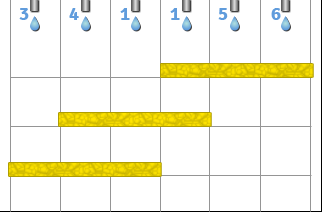

#CountPlacements
作者：徐泽涛

关键词：$$DP$$ 片段和优化
##题目简述
很久很久以前，$$N$$个水龙头从左往右 与地面平行 等距 一字排开，每个水龙头占用一单位宽度，从左往右第$$i$$个水龙头会流出$$a[i]~mol$$的$$H_2O$$液体。

一个活泼可爱的小朋友拥有$$M$$个宽度为$$L$$的脸盆，他要把每个脸盆放在这排水龙头下面接$$H_2O$$。需要满足：

1.对于每个脸盆，在没有其他脸盆存在的情况下，能够恰好接到连续的$$L$$个脸盆的$$H_2O$$，即每个脸盆的最左端不超过最左边的水龙头，最右端不超过最右边的水龙头。
2.脸盆还可以被指定一个高度，于是各个脸盆在上下方向上可能会互相阻挡，不过两个脸盆的某一部分不能相重合。
3.每一个水龙头的$$H_2O$$会由上至下落下，并被由上至下接触到的第一个脸盆接住，每一个脸盆接到的$$H_2O$$的物质的量需要在$$[A,B]~(mol)$$之间

以下是$$N=6~a=\{3,4,1,1,5,6\}~M=3~L=3$$的一个情况。

(图中黄色条状物体是脸盆)

图中从左往右各个脸盆分别接到$$3,5,12~mol$$的$$H_2O$$液体。

你需要确定有多少组方案($$mod~1000000007$$)使得每个脸盆接到的$$H_2O$$液体的物质的量都介于$$A~mol$$和$$B~mol$$。

两组方案等价，当且仅当每个水龙头的$$H_2O$$都落在了同一个脸盆里（或落到地面上被浪费）（各个脸盆不作区分，即可以从左往右标号）。

数据范围$$1<=N<=300~1<=M<=300~1<=L<=N~1<=A<=B<=2700$$

##算法一

显然，每个脸盆能够接到的$$H_2O$$一定是连续的一段，所以$$DP$$的思路是从左往右把这些水龙头切成一段又一段，分给各个脸盆（当然也可以落到地面上）。

我们考虑怎样的切割方法是合法的。

首先，以被浪费的水龙头为界，将没有被浪费的水龙头分成了若干块（每一块是连续的一段没有被浪费的水龙头），各块互相独立。每一块被该块内部接水区间紧挨的若干个脸盆瓜分。每一块内部一定存在一个高度最高的脸盆（废话），它不被任何其他脸盆所阻挡，于是正好能够接住$$L$$个水龙头的$$H_2O$$。这一块内部的其他脸盆，接到的部分长度都小于等于$$L$$（废话，总共也就那么长）。而且只要满足以上条件，方案一定能够实现，因为只要确定了那个正好接住$$L$$个水龙头的最高的脸盆，其余脸盆都可以以阶梯状从中心向两边排出任何你想要的区间集。

于是。区间切割分配的方案(也就是要求的***方案***)合法当且仅当每一个联通块(紧挨即联通)内部都至少存在一个区间长度正好为$$L$$，且其他的长度均小于等于$$L$$。

从左往右考虑$$DP$$。

$$f[i][j]$$表示前$$i$$个水龙头，共放了$$j$$个脸盆，最后一个水龙头没有被浪费，最后一个水龙头所在的联通块的所有区间长度都**严格小于$$L$$**方案数。

$$g[i][j]$$表示前$$i$$个水龙头，共放了$$j$$个脸盆，最后一个水龙头没有被浪费，最后一个水龙头所在的区间已经出现过一个长度正好为$$L$$的区间的方案数。

$$h[i][j]$$表示前$$i$$个水龙头，共放了$$j$$个脸盆，最后一个水龙头被浪费的方案数。

最终答案为$$g[N][M]+h[N][M]$$。

可写出如下状态转移方程：（方便起见，以下令$$S(L,R)=\sum_{i=L}^{R}a[i]$$）

---
$$f[i][j] = \sum_{x=0}^{L-1}{(f[i-x][j-1]+h[i-x][j-1])}(A\le S(i-x+1,i)\le B)$$

$$g[i][j] = (i\ge L且A\le S(i-L+1,i)\le B ? f[i-L][j-1]+h[i-L][j-1]: 0)+\sum_{x=0}^{L-1}{g[i-x][j-1]}(A\le S(i-x+1,i)\le B)$$

$$h[i][j] = g[i-1][j]+h[i-1][j])$$

时间复杂度为$$O(NML)$$，片段和优化即可$$O(NM)$$