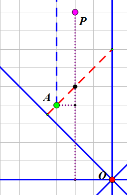

# GooseInZooDivOne
作者：叶珈宁

关键词：DFS 计数
## 题目简述
有一张$$n\times m$$的网格图，上面的每个格子要么是空的（用字符'.'表示），要么住着一只鸟（用字符'v'表示）。

每只鸟可能是鸭子也可能是鹅，已知：

1、距离任意一只鹅曼哈顿距离不超过$$dist$$的鸟都是鹅。

2、鹅至少有一只，且总数是偶数。

问有多少种不同的合法情况。

$$1\leq n,m\leq 50,0\leq dist\leq 100$$.

## 解题思路

可以把一只鸟和与它曼哈顿距离不超过$$dist$$的鸟放到同一个集合里。那么认定一只鸟是鹅就相当于认定这一整个集合的鸟都是鹅。

统计出大小是奇数和大小是偶数的集合个数，设为$$a,b$$。那么奇数的集合必须选偶数个，偶数的集合可以选任意个，再减掉一只鹅都没有的情况。

当$$a=0$$时，答案是$$2^b-1$$，否则答案就是$$2^{a+b-1}-1$$。

那么现在需要解决的问题就只有统计出大小为奇数和偶数的集合各有几个。

## 算法1
直接记忆化搜索，爆搜每个没有处理过的点，然后$$\mathcal{O} (nm)$$枚举所有和它距离不超过$$dist$$的点，如果这个点没有搜过就继续搜索它。这样$$\mathcal{O}(nm)$$个状态，每个状态的出边数量是$$\mathcal{O}(nm)$$的，总复杂度是$$\mathcal{O}(n^2m^2)$$的。

这个做法简单好写，足以通过这个数据范围，TC的官方题解就介绍了这种做法。

## 算法2
不妨先用$$\mathcal{O}(nm)$$的复杂度预处理出每个格子上方和下方第一只鸟的位置，仍然记忆化搜索。考虑一个事实：对于当前点$$(i,j)$$，只需要借助预处理出的信息，继续对所有$$k$$搜索$$(i,k)$$这些点（如果上面有鸟的话）以及第$$(i,k)$$上方和下方第一只鸟就可以了。这样复杂度就降到了$$\mathcal{O}(nm\min(n,m))$$。

## 算法3
原问题就是在每对距离不超过$$dist$$的点之间连了一条边，要求能够求出连通性状况。

考虑到上一个做法其实是用更少规模的边来建了一张图，得到了和原图一样的连通性，那能不能用更少的边来得到一样的连通性呢？答案是肯定的。

对于当前点，设它为原点，用$$x$$轴，$$y$$轴，直线$$y=x$$，直线$$y=-x$$将整张图分为16个部分（8个平面区域和8个射线区域）。将这个点和每个区域中离它最近的点连一条边，这张图的连通性和原图是等价的。下面从搜索的角度给个简单的证明方向：

考虑其中某一个区域，其它的可以类比来论证。

红色的虚线段上的点和原点距离相等，假设红线上的点$$A$$是离$$O$$最近的一个点，那么如果红线上有多个点显然任取一个都可以（其它的点会被$$A$$给搜索到）。

考虑某个红线外的点$$P$$（红线内没有点），$$PA$$之间的距离是严格小于$$PO$$之间的距离的。则对于某个和$$O$$距离不超过$$dist$$的点，它要么已经被搜过了，要么是最近的点之一，要么存在一个点缩短了距离。因此$$P$$一定会被搜到。

而每个点每个区域最近的点显然可以通过$$\mathcal{O}(nm)$$的预处理来得到。预处理完后的搜索过程中，每个点出边16条，是常数级别的，复杂度是$$\mathcal{O}(nm)$$的。

## 算法4
可是上一个做法也未免太zz了……还有一些更simple的$$\mathcal{O}(nm)$$做法，下面介绍一种。

把四联通的所有点之间连上一条边，从所有鸟开始bfs，每个点$$u$$记录距离它最短的鸟里编号最小的那只，记为$$poi(u)$$。对于图中的每条边$$(u,v)$$，check一下$$poi(u)$$和$$poi(v)$$是否属于一个集合，如果是的话就把他们并起来。

这样为什么是对的呢？可以考虑这样证明模式：

如果两个点$$u,v$$的距离不超过$$dist$$，那么随便拿出它们之间的一条最短路。考虑最短路的中点（可能有两个），如果这附近的两个点的$$poi$$恰好是$$u$$和$$v$$，那么就done了。否则存在一个离这个点距离更短或者距离相等但是编号更小的点$$w$$，则可以把证明递降到$$u,w$$以及$$v,w$$之间的连通性证明。

于是就得到了一个simple的$$\mathcal{O}(nm)$$做法。