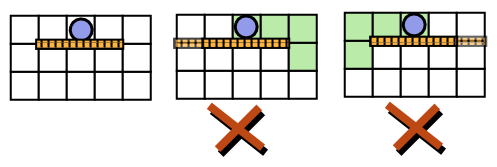
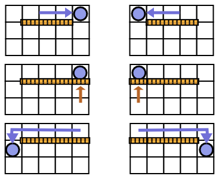

# WallGameDiv1

作者：杨家齐

关键词：博弈, 动态规划, 记忆化搜索

## 题目简述

Rabbit 和 Eel 在玩一个游戏. 游戏在一个 $$n \times m$$ 的棋盘上进行, 在这个游戏中, 玩家需要操作一个棋子, 将它从第一行移动到最后一行(当棋子被移动到最后一行时, 游戏立刻结束). 在第 $$i$$ 行第 $$j$$ 列有一个数字 $$a_{ij}$$, 表示经过这个格子的代价.

游戏由若干轮组成. 每一轮由 Rabbit 先操作. 在第一轮, Rabbit 会把一个棋子放在第一行的某一列上, 并付出相应的费用. 在接下来的每一轮中, Rabbit 先把棋子向左, 向右, 或向下移动一步, 然后付出相应的费用. 然后由 Eel 操作. Eel 可以选取一对 $$(i, j)$$, 其中 $$1 \le i < n$$ 并且 $$1 \le j \le m$$, 然后在 $$(i, j)$$ 和 $$(i + 1, j)$$ 之间修建一堵墙. Eel 每次操作可以修建任意多的墙, 但是在任意时刻, Eel 修建的墙都不能够使游戏无法结束(也就是说, Eel 修建的墙不能阻止棋子从当前的位置移动到最后一行).

Rabbit 的目标是最小化花费, 而 Eel 的目标是最大化 Rabbit 的花费. 现在假设双方都绝顶聪明, 你需要求出最后的花费.

注意: 多次经过同一个位置的花费算**多次**.

## 限制与约定

$$
1 \le n, m \le 50, 0 \le a_{ij} \le 9
$$

## 算法

首先注意到两个结论:

1. Eel 一定是等 Rabbit 走到某个位置下面, 再决定是否放墙;
2. 如果 Eel 没有在 Rabbit 的下面放墙, 那么 Rabbit 一定要走下去.

结论 1 是因为, Rabbit 知道的信息越多, 局面就对 Rabbit 越有利, 比如说

如果像上图这样, 我们过早地放了过多的墙的话, Rabbit 就知道该怎么走了, 而

如果像上图这样, 我们等 Rabbit 走到对应的位置再放墙的话, 就可以把 Rabbit "骗" 到一些本来不需要走的地方去, 从而增加 Rabbit 的花费.

结论 2 是因为, 如果 Rabbit 不走下去的话, 我们可以把其他所有位置放上墙, 从而逼迫 Rabbit 走下去; 而如果我们不希望 Rabbit 从这里走下去的话, 我们就必须要在这个位置放墙.

于是我们可以得到一个推论: 每一行的墙的位置一定是连续的.

接下来我们可以设 $$f[i][l][r][s]$$ 表示当前在第 $$i$$ 行, $$s = 0$$表示有墙的列的编号为$$(l, r]$$, 当前棋子的位置是 $$l$$; $$s = 1$$表示有墙的列的编号为$$[l, r)$$, 当前棋子的位置是 $$r$$.

转移时只需要枚举 Eel 是否要在当前位置下面修墙, 如果修墙的话 Rabbit 是从当前位置走到 $$l - 1$$ 更好还是走到 $$r + 1$$ 更好, 就可以了.

时间复杂度: $$O(n^3)$$.
