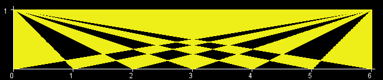
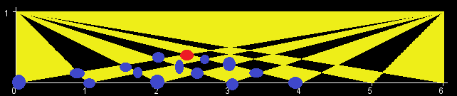

#TriangleXor
作者：邢健开
关键词：容斥原理
##题目描述
给出一个四个顶点坐标为(0,0),(0,1),(w,0),(w,1)的矩形，在这个矩形中以(0,1),(w,1),(i,0)(i=0...w)画出w+1个三角形，在矩形被分成的每一块区域中，如果被覆盖了奇数次，那么把这个区域的面积计入答案，偶数次则不计，问总面积是多少。
##时间、空间限制
2s/64MB
##数据范围
$$1\le w\le 70000$$
##分析
考虑容斥原理，算出每一块区域被覆盖了多少次。
对于两条线段(0,1)(i,0)和(w,1)(j,0)以及矩形上边界围成的三角形，只有下顶点位于(0,1)(i,0)和(w,1)(j,0)以及矩形下边界围成的三角形能完全包含它。
即对于

完全包含红点的三角形只有蓝点和(0,1)(w,1)围成的三角形

于是，计算每个区域被覆盖的次数以及区域的面积可以转化为计算每个顶点和矩形上边界围成三角形的面积，再通过加减来完成。
并且，底边长度相同的三角形高度都是相同的，于是可以分层。
##算法一
显然最底层每个顶点代表的三角形面积要被计算一次。
从底层枚举每个顶点作为红点，再枚举其下方的蓝点（红蓝如上图所示），统计所有蓝点被计算的次数x，然后设这个点是倒数第i层。
若i是奇数，则需把x补成1，那1-x就是这个点要被计算的次数。
若i是偶数，则需把x补成0，那-x就是这个点要被计算的次数。
这样一层一层推上去
###时空复杂度
一共$$O(n^2)$$个点，枚举每个点要遍历下面的所有点，时间复杂度$$O(n^4)$$
空间复杂度O(1)。
##算法二
在算法一的基础上，显然我们要得到点i之前被计算的次数，只需要用这个点下一层的两个点计算次数之和减去下下一层中间那个点的计算次数就可以了，不需要枚举所有点。
###时空复杂度
时间复杂度$$O(n^2)$$
空间复杂度$$O(n)$$。
##算法三
每一层的三角形的计算次数都是相同的，所以可以直接一层一层推。
并且打了几层的表可以发现，除了最底层的点要被计算一次，倒数第i层的点要被计算$$2*(-1)^{i-1}$$次。
###时空复杂度
时间复杂度$$O(n)$$
空间复杂度$$O(1)$$。
