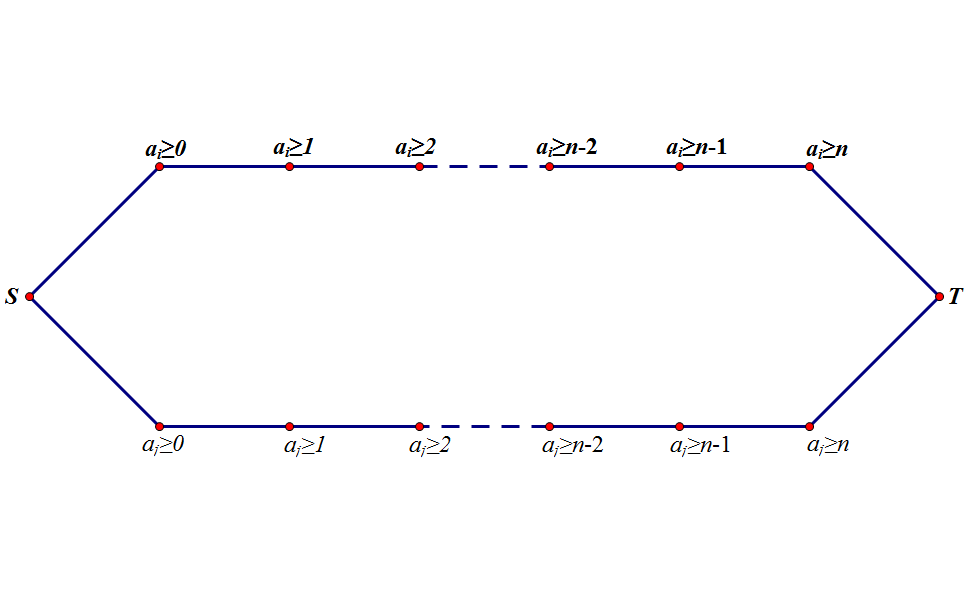
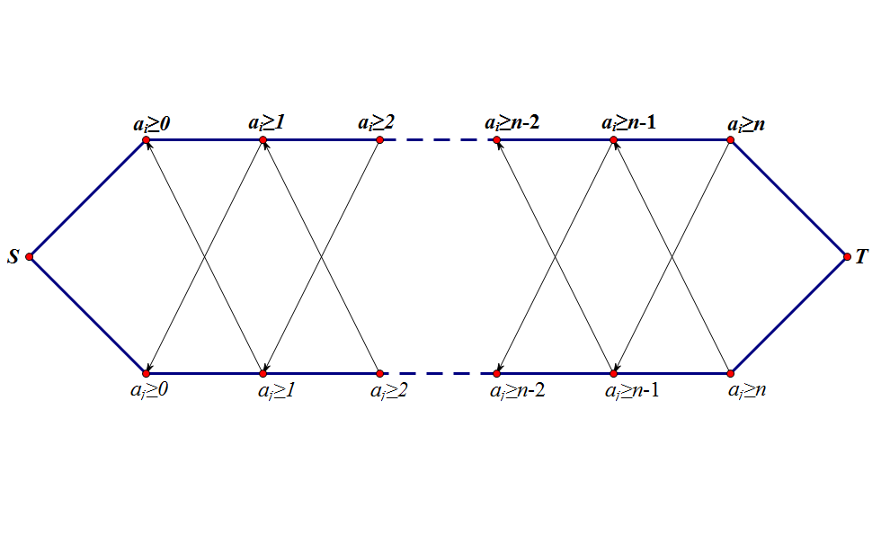
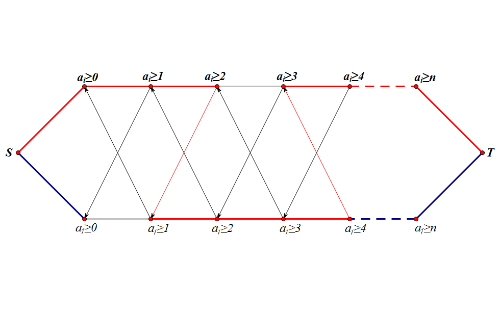

# FoxAndCity

作者：熊云帆

关键词：网络流

## 题目简述

​	给定一张无向图，每条边的边权都是$$1$$，所有的点用$$1$$~$$n$$编号。每个点的点权$$a_i$$定义为这个点到$$1$$号点的最短路长度。每个点还有一个值$$b_i$$。

​	你可以通过给这张图添上若干条边来改变一些点的点权。要求最小化$$\sum_{i=1}^n(a_i-b_i)^2$$。

## 算法一

对于一个合法的最终状态，一定满足：

- 若在原图中i到j有连边，有$$|a_i-a_j| \leq 1$$

- $$a_1=0$$

对于一个满足上述条件的数组$$a_i$$，按照下述方法一定可以构造出一个合法的图：

1. 按照$$a_i$$的值排序建出分层图。
2. 每个点向它的前一层，当前层和后一层连边。

因此，原问题等价于构造一个满足上述条件的数组$$a_i$$使得$$\sum_{i=1}^n(a_i-b_i)^2$$的值最小。

直接枚举所有合法情况。按照拓扑序枚举时，每个$$a_i$$至多只有三种取值，状态数是$$O(3^n)$$，需要$$O(n)$$判断是否合法，$$O(1)$$计算答案。

时间复杂度：$$O(n*3^n)$$。

## 算法二

考虑用网络流来解决这个问题。

如图，$$S​$$和$$T​$$表示源点和汇点。若$$a_i \geq k​$$和$$S​$$联通则表示第$$i​$$个点的值至少位$$k​$$。

注：**图中的边为从左到右的有向边。**

如图，若点$$i$$和点$$j$$有边相连，则连出所有的边$$< a_i \geq k,aj \geq k-1 >$$和$$< a_j \geq k,a_i \geq k-1 >$$。

这样，我们就可以保证若边$$< a_i \geq k,a_i \geq k+1 >$$被割，则$$< a_j \geq k-1,a_j \geq k >$$ $$< a_j \geq k,a_j \geq k+1>$$ $$< a_j \geq k+1,a_j \geq k+2>$$中有且只有一条边被割开。

特别地，当$$k=0$$时，$$k-1$$为$$S$$；当$$k=n$$时，$$k+1$$为$$T$$。

例如：

从图中我们可以看到，如果$$a_i$$对应的$$a_j$$中的三条边中有一条边未在割中出现，那么$$a_i$$中被割掉的那条边是无效的。所以对于最小割中的任意一条边，其对应的三条边中一定有一条在割中出现。

并且，这不但是必要条件，也是充分条件。考虑反证法：如果存在从$$S$$到$$T$$的通路，那么考虑最后一条边所属于的点。设上一个点为$$j$$，因为$$j$$无法走到$$i$$，所以矛盾。

图建出来后跑最小割即可。

点数$$n^2$$，边数$$n^3$$，所以复杂度$$O(n^4)$$。

时间复杂度：$$O(n^4)$$。