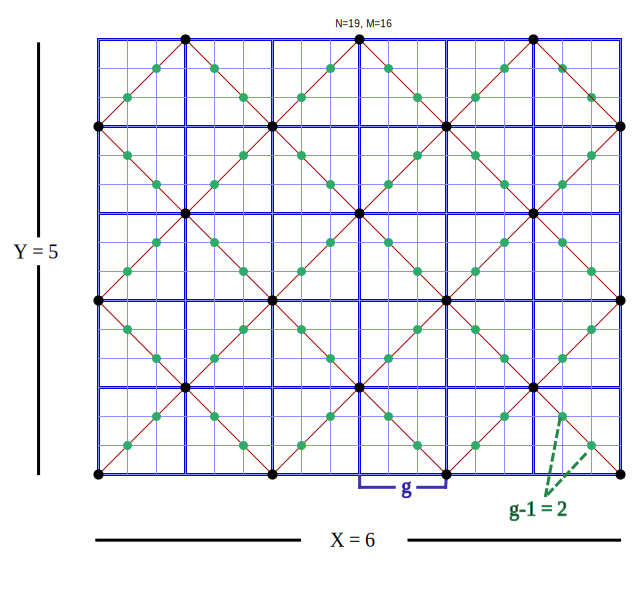

#PyramidSequences

作者：杨景钦

关键词：最大公约数， 数形结合

##题目描述

定义一个高度为$$x$$的金字塔序列为如下的无限长序列：

$$1,2,3,.....,x-1,x,x-1,x-2,.....,2,1,2,3....$$

现在给出$$n$$和$$m$$，令$$A$$是高度为$$n$$的金字塔序列， $$B$$是高度为$$m$$的金字塔序列， 求有多少个不同的数对$$(x, y)$$， 满足存在一个$$i \ge 1$$ 使得$$A_i = x 且 B_i = y$$

$$2 \leq n, m \leq 10^9$$

##算法一

直接枚举所有$$i$$， 注意到循环节是$$[n,m]$$ 于是可以暴力枚举。

复杂度$$O(N \times M)$$

##算法二

不妨将序列中的每个数以及$$n$$和$$m$$先$$-1$$，这样数列可以从$$0$$开始 以后的讨论均按照$$-1$$之后的序列来讨论。

首先需要一点数形结合的想法。 我们把一个点对$$(x, y)$$当成一个平面上的横坐标为$$x$$， 纵坐标为$$y$$的点。

令第$$i$$个点为$$(A_i, B_i)$$， 我们把第$$i-1$$个点和第$$i$$个点($$1 \leq i \leq [n,m] - 1$$）顺次相连。 形成了一条优美的折线。

令$$g$$为$$n和m$$的最大公约数($$gcd$$)

我们发现有些点被折线经过多次， 其他点只被经过一次。 通过一些显然的分析可以得到， 这些点的横纵坐标均为$$g$$的倍数， 再仔细观察可以看出这样一张图。

于是可以看出， 我们可以将原地图分成$$g*g$$的方块。 每个块内的只被经过一次的点有$$g-1$$个， 而被经过多次的点可以很轻易的算出。 结果为$$( (x+1) * (y+1) + 1) / 2$$  

其中$$x$$为$$n / g$$， $$y$$为$$m / g$$

复杂度$$O(logN)$$